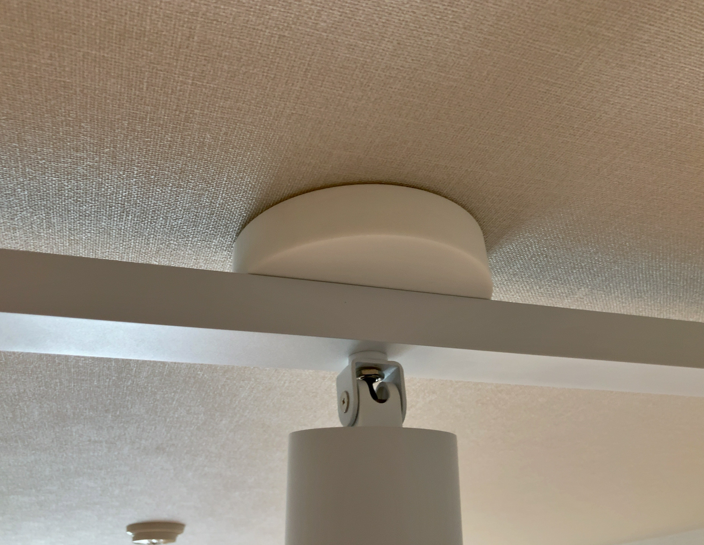

# Ceiling Cover
Ceiling cover for Grid PLUS 3/4 - down light ARTWORKSTUDIO (Unofficial） 

## 概要
  * ARTWORKSTUDIOのGrid PLUS 4とGrid PLUS 3に対応した非公式シーリングカバーです。  
  * 付属のシーリングカバーは『丸型引掛シーリング』『ローゼット型取付器具』に対応していません。  
  * 『丸型引掛シーリング』『ローゼット型取付器具』に対応したシーリングカバーを設計しました。
  * 留め具の突起があるため、片方のみ中央部分に切り欠きがあります。
  * 切り欠きがあるパーツと切り欠きがないパーツを組み合わせて使用します。

## 使用例
使用前  

使用後　白色(JLPCBのSLS/Nylon 1172Pro)  

使用後　黒色(JLPCB SLS/Nylon 3201PA-F)  

## 注意点
  * 本カバーはARTWORKSTUDIO非公式です  
  * 材質や安全性等の評価をしていません
  * データの使用・出力したカバーの使用は自己責任でお願いいたします
    
CC BY-NC-ND
